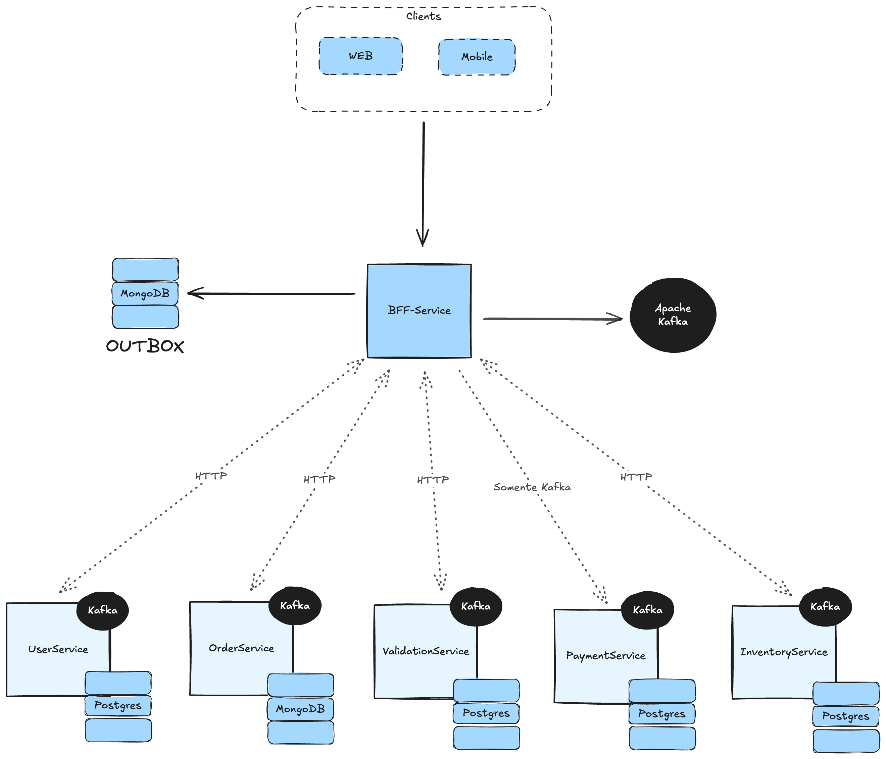

## Introdução

A **AutoStoreApi** é uma aplicação backend desenvolvida aplicando: Arquitetura de Microsserviços, Saga Orquestrado.
O objetivo é gerir o estoque de uma loja de automóveis, ordens de compra e vendas, e controle de clientes.
O ponto-chave da arquitetura proposta é a resiliência e consistência dos dados, mesmo em cenários de falhas,
que conseguimos graças ao controle de transações distribuídas utilizando o padrão Saga Orquestrado.

### Video Apresentação

*In Progress...*

[](https://www.youtube.com/watch?v=1234567890)

## Summary

* [Technology Stack](#technology-stack)
* [Architecture](#architecture)
* [Code Design](#code-design)
* [CI/CD](#cicd)
* [Executing the project](#executing-the-project)
* [Accessing the API](#accessing-the-api)
* [Testing Best Practices](#testing-best-practices)
* [Kafka Events Reference](#kafka-events-reference)

## Technology Stack

* **Java 17**
* **Spring Boot 3**
* **Apache Kafka**
* **API REST**
* **PostgreSQL**
* **MongoDB**
* **Docker**
* **docker-compose**
* **Redpanda Console**

[Go to page beginning](#introdução)

## Architecture


[Go to page beginning](#introdução)

## Code Design

O código foi implementado utilizando Arquitetura Hexagonal (Ports and Adapters), seguindo os princípios do SOLID e boas
práticas de Clean Code.

### Architecture Layers

* **Domain**: Contém as entidades, agregados, repositórios e serviços de domínio. Esta camada é independente de
  qualquer tecnologia ou framework. Nesse projeto, a única dependência externa é a biblioteca Lombok, utilizada
  para reduzir o boilerplate code, que pode ser facilmente removida posteriormente sem impactar no comportamento da
  aplicação.

####

* **Application**: Contém as ports (interfaces) e casos de uso (use cases) da aplicação. Essa camada orquestra a
  lógica de
  aplicação, coordenando as operações entre a camada de domínio e as camadas externas.

####

* **Adapters**: Contém as implementações concretas das Ports definidas na camada de aplicação, tanto as
  implementações REST (Controllers) e as implementações de Eventos (Kafka Consumers), para os Driven Adapters.
  Quanto as implementações dos repositórios que interagem com o banco de dados e os Event Producers (Kafka Producers)
  sendo os Driven Adapters.

####

* **Configuration**: Contém as classes de configuração da aplicação, como configuração de exceções, segurança,
  banco de dados, Kafka, etc.

  [Go to page beginning](#introdução)

## CI/CD

O projeto utiliza GitHub Actions para integração contínua (CI). O pipeline de testes é
acionado em cada push ou pull request para a branch main, porém a branch main está protegida para evitar
commits diretos, garantindo que todas as alterações passem por revisão de código os testes automatizados.

O pipeline de CI irá falhar se algum dos testes não passar ou se houver uma cobertura de código insuficiente, neste
caso < 80%.

[Go to page beginning](#introdução)

## Executing the project

Para a execução local do projeto, é necessário ter o Docker e o Docker Compose instalados na máquina, e executar o
comando:

```bash
docker-compose up -d --build
```

ou utilize o Makefile:

```bash
make setup
```

Este repositório inclui um script `build.py` que automatiza o processo de build dos microsserviços e a execução do
`docker-compose`.

### Accessing the API

Uma vez que os contêineres estejam em execução, você pode acessar a API BFF através do endereço:

```text
http://localhost:3000/swagger-ui/index.html
```

[Go to page beginning](#introdução)

### Testing Best Practices

A aplicação foi desenvolvida seguindo o TDD (Test-Driven Development) e BDD (Behavior-Driven Development), utilizando
o JUnit e o Cucumber, conseguimos aplicar o TDD até nas camadas de integração com o banco de dados e Kafka, graças ao
uso do Testcontainers.

Para executar os testes, utilize o comando:

```bash
make test
```

*Nem todos os microsserviços ainda possuem teste de aceitação e uma cobertura suficiente, mas será implementado*

[Go to page beginning](#introdução)

## Kafka Events Reference

Para facilitar o entendimento dos eventos Kafka utilizados na aplicação, segue uma tabela de referência:

#### PRIMARY COMMANDS

| TOPIC                    | PRODUCER    | CONSUMER          | PURPOSE                             |
|--------------------------|-------------|-------------------|-------------------------------------|
| validate-order-command   | bff-service | order-service     | Inicia a validação do pedido        |
| process-payment-command  | bff-service | payment-service   | Inicia o processamento do pagamento |
| update-inventory-command | bff-service | inventory-service | Inicia a atualização do inventário  |

#

#### ROLLBACK COMMANDS

| TOPIC                             | PRODUCER           | CONSUMER    | PURPOSE                                        |
|-----------------------------------|--------------------|-------------|------------------------------------------------|
| rollback-inventory-update-command | inventory-service  | bff-service | Inicia o rollback da atualização do inventário |
| refund-payment-command            | payment-service    | bff-service | Inicia o reembolso do pagamento                |
| rollback-order-validation-command | validation-service | bff-service | Inicia o rollback da validação do pedido       |

#

#### TOPIC SUCCESS

| TOPIC                                    | PRODUCER           | CONSUMER    | PURPOSE                                                    |
|------------------------------------------|--------------------|-------------|------------------------------------------------------------|
| order-service-order-created-v1           | order-service      | bff-service | Indica que o pedido foi criado com sucesso                 |
| validation-service-validation-updated-v1 | validation-service | bff-service | Indica que a validação do pedido foi concluída com sucesso |
| payment-service-payment-processed-v1     | payment-service    | bff-service | Indica que o pagamento foi processado com sucesso          |
| inventory-service-inventory-updated-v1   | inventory-service  | bff-service | Indica que o inventário foi atualizado com sucesso         |

#

#### TOPIC FAILED

| TOPIC                                   | PRODUCER           | CONSUMER    | PURPOSE                                        |
|-----------------------------------------|--------------------|-------------|------------------------------------------------|
| order-service-order-failed-v1           | order-service      | bff-service | Indica que a criação do pedido falhou          |
| validation-service-validation-failed-v1 | validation-service | bff-service | Indica que a validação do pedido falhou        |
| payment-service-payment-failed-v1       | payment-service    | bff-service | Indica que o processamento do pagamento falhou |
| inventory-service-inventory-failed-v1   | inventory-service  | bff-service | Indica que a atualização do inventário falhou  |

#

#### ROLLBACK SUCCESS

| TOPIC                                             | PRODUCER           | CONSUMER    | PURPOSE                                                                      |
|---------------------------------------------------|--------------------|-------------|------------------------------------------------------------------------------|
| inventory-service-inventory-rollback-success-v1   | inventory-service  | bff-service | Indica que o rollback da atualização do inventário foi concluído com sucesso |
| payment-service-payment-refund-success-v1         | payment-service    | bff-service | Indica que o reembolso do pagamento foi concluído com sucesso                |
| validation-service-validation-rollback-success-v1 | validation-service | bff-service | Indica que o rollback da validação do pedido foi concluído com sucesso       |

#

#### ROLLBACK FAILED

| TOPIC                                            | PRODUCER           | CONSUMER    | PURPOSE                                                   |
|--------------------------------------------------|--------------------|-------------|-----------------------------------------------------------|
| inventory-service-inventory-rollback-failed-v1   | inventory-service  | bff-service | Indica que o rollback da atualização do inventário falhou |
| payment-service-payment-refund-failed-v1         | payment-service    | bff-service | Indica que o reembolso do pagamento falhou                |
| validation-service-validation-rollback-failed-v1 | validation-service | bff-service | Indica que o rollback da validação do pedido falhou       |
